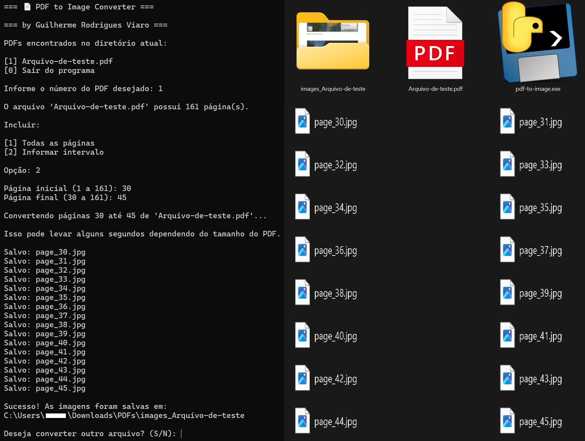

# 📄 PDF to JPEG Converter (CLI)

Um conversor interativo CLI (Command Line Interface) que transforma arquivos PDF em JPEG de forma offline, prática, eficiente, organizada e com boa resolução. 

Desenvolvido em Python, foi idealizado por uma necessidade pessoal, permitindo, com maior facilidade, sem anúncios, sem extensões e sem internet, manipular imagens dos PDFs sem recorrer a prints de tela, que prejudicam muito a qualidade do arquivo. 

## ✨ Funcionalidades

- **Menu Interativo:** Interface limpa no terminal para seleção de arquivos.
- **Leitura Automática:** Identifica todos os arquivos `.pdf` no diretório atual.
- **Adaptabilidade:** Opção de converter o arquivo inteiro ou selecionar um intervalo específico de páginas.
- **Auto-Organização:** Cria automaticamente uma pasta dedicada para salvar as imagens, salvando-as de forma organizada e enumerada.

## 🚀 Como Usar

Buscando maior praticidade, o arquivo executável disponibilizado abaixo permite o uso da ferramenta sem configurar um ambiente de desenvolvimento.

### Executável 

1. Vá até a aba **[Releases](https://github.com/guirv/PDF-to-JPEG-Converter-CLI-/releases/latest)** deste repositório.
2. Baixe o arquivo `pdf-to-image.exe`.
3. Coloque-o na MESMA PASTA onde estão os arquivos PDF que você deseja converter.
4. Dê um duplo clique no `.exe` e siga as instruções na tela!

### Exemplo Interface-Resultado

## 🛠️ Tecnologias Utilizadas

- **Python 3**

- **pdf2image:** Wrapper para conversão dos PDFs.

- **Pillow (PIL):** Manipulação e salvamento dos arquivos de imagem.

- **Poppler:** Motor de renderização do PDFs.

- **PyInstaller:** Empacotamento do script e dependências em um executável autônomo.

## 👨‍💻 Autor

- Desenvolvido por **Guilherme Rodrigues Viaro.**